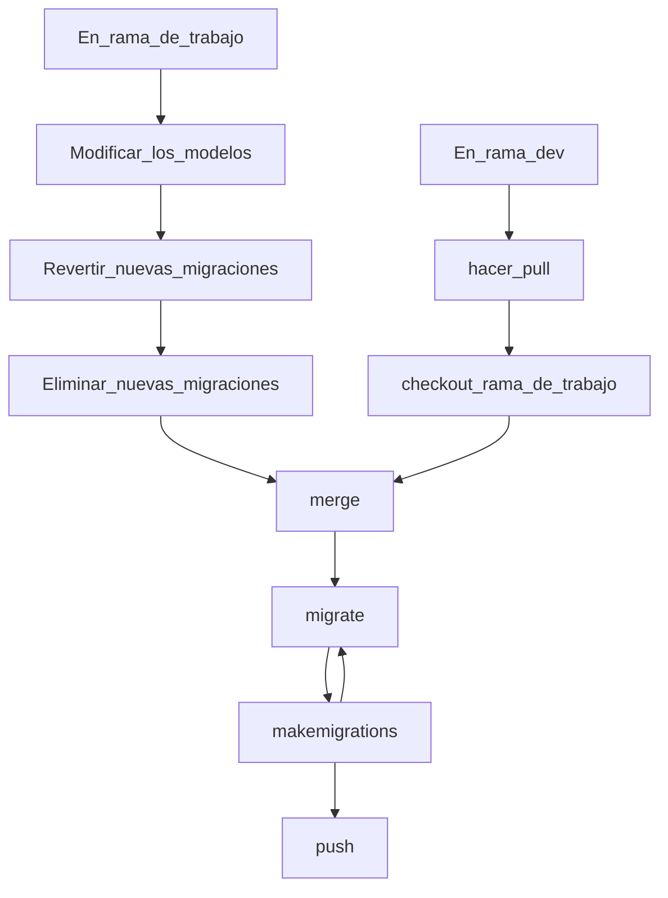
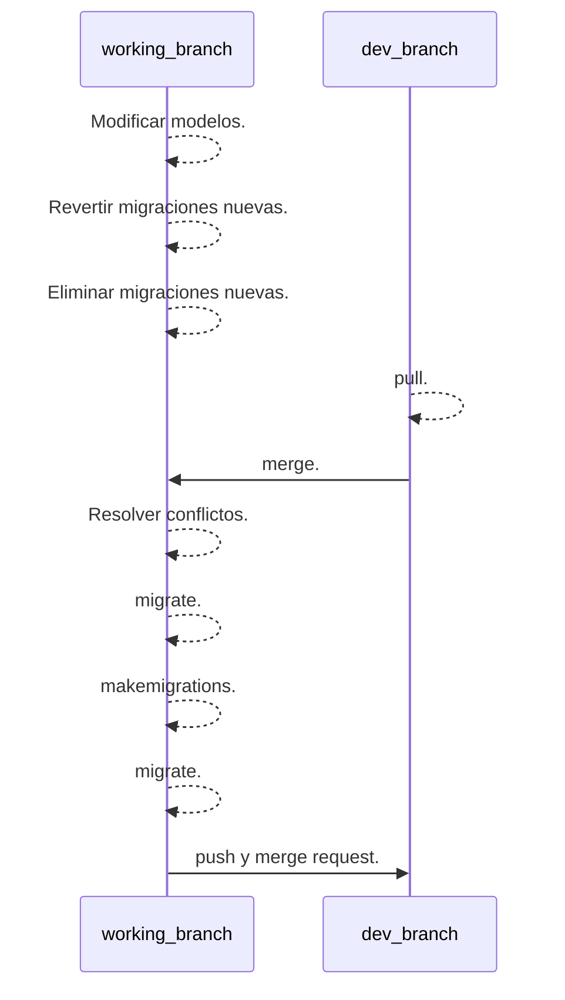

# Django - Migrations.

Las migraciones son la forma que tiene Django de propagar los cambios hechos en el esquema de los modelos de la aplicación.

Es una especie de versión de controles para las bases de datos. __makemigrations__ se encarga de empaquetar en un archivo _migrate_ todos los cambios realizados a los modelos, análogo a un _commit_, y __migrate__ es responsable de aplicar dichos cambios a la base de datos de la APP.

## Workflow.

Al ejecutar el comando `python manage.py makemigrations` el modelo, no la base de datos, será escaneado y comparado con la versión actual contenida en los archivos de migraciones, y luego será escrito un nuevo archivo de migración con los nuevos cambios detectados en el código de los modelos.

Una vez tengamos el nuevo archivo _migrate_ podremos aplicar los nuevos cambios a la base de datos utilizando el comando `python manage.py migrate`.

Una vez aplicada la migración es necesario hacer un _commit_ con la migración y el modelo modificado, para que así otras personas puedan tener los mismos cambios que nosotros y trabajar sobre los mismos modelos y la misma base de datos, pero esto solo después de cerciorarnos de que no existen conflictos, que el registro mantiene la coherencia y que las ramas están actualizadas.

Cuando dos ramas de desarrollo se unen, es posible que sea necesario unir las migraciones a mano, con el fin de evitar que se generen inconsistencias en la secuencia lineal que tienen las migraciones, ya que Django necesita que se siga la consistencia del historial.

los detalles a tener en cuenta a la hora de crear y aplicar migraciones son los siguiente: 

* Durante el trabajo será necesario crear múltiples migraciones para que Django puede ejecutarse correctamente, sin embargo hay que tener cuidado de no agregar estas nuevas migraciones a los _commits_ que creemos, ya que deberemos eliminarlas luego.

* Antes de hacer hacer _merge_ con la rama _develop_ (la cual procuraremos que siempre esté actualizada) podemos revertir todas las migraciones aplicadas hasta la ultima coincidente con la rama _develop_ utilizando el comando:

   `python manage.py migrate <app> <migration_code>` 

  para tener total seguridad de no generar ningún conflicto al volver a tener nuestra base de datos idéntica a la de la rama _develop_. 

* Al hacer _merge_, si la rama _develop_ tiene un nuevo archivo de migración, lo primero que debemos hacer será aplicar dicha migración, para luego crear un nuevo archivo de migración con nuestros nuevos cambios y volver a aplicar las migraciones, es decir, al hacer el merge y resolver los conflictos, utilizamos `python manage.py migrate`, aplicamos los nuevos cambios y ahora utilizamos `python manage.py makemigrations` para registrar nuestros nuevos cambios y posteriormente aplicarlos de nuevo con `python manage.py migrate`.

De este modo nos aseguramos de no romper la secuencia en el registro de migraciones y de evitar generar conflictos respecto a los cambios que puedan hacer otros miembros del equipo.

---

## Dependencias.

Si bien las migraciones son por aplicación, las tablas y relaciones implícitas en los modelos son demasiado complejas como para crear una app a la vez, ya que si tenemos un modelo son una _ForeignKey_, se debe verificar la tabla referenciada primero, ya que si Django identifica que la tabla referenciada no existe retornará un error.

## Consistencia del Historial.

