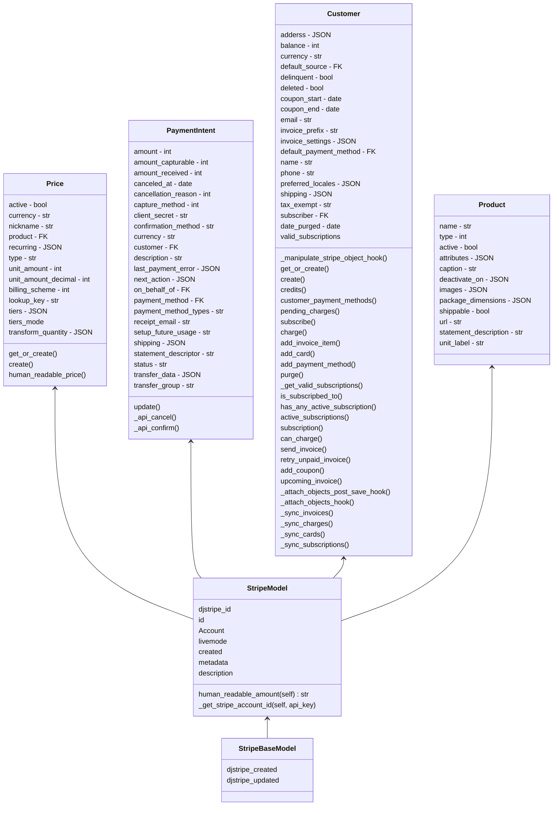

# Dj-Stripe


## Comandos esenciales. 

Sincronizar toda la base de datos local.

```python
>>> python manage.py djstripe_sync_models
```

https://dj-stripe.dev/usage/manually_syncing_with_stripe/


## Modelos.



Ciertos modelos contienen campos especiales definidos en la siguiente carpeta de la librería:

```shell
/venv/lib/python3.8/site-packages/djstripe/fields.py
```