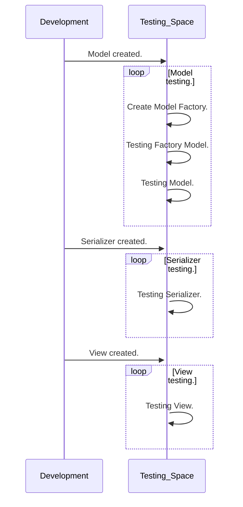

# Quality Assurance.

Es el departamento o división del equipo de desarrollo encargada de la gestión de la calidad del producto o servicio.


## Funcionamiento.

-  Descubrir errores específicos.
- Definir todos los casos de pruebas posibles.
- Detectar nuevos errores.
- Anticipar los posibles nuevos bugs. 

---

## Conceptos básicos.

### Validación.


### Verificación.


### Autenticación.


---


## Tipos de pruebas.

Se puede diferenciar entre dos conjuntos de pruebas principales, las pruebas funcionales y las no funcionales.

### Pruebas funcionales.

Es la automatización de pruebas de software que se realiza para comprobar las características y requerimientos del mismo, para cerciorarse de que se comporta como debe hacerlo. 

Unas de las principales son las __pruebas unitarias__ y las __pruebas de integración__. Las primeras comprueban el funcionamiento de cada módulo de código y las segundas se aseguran de que tras añadir nuevos módulos todo funcione correctamente.

También existen __pruebas de validación__ centradas en las acciones perceptibles para los usuarios y las __pruebas de aceptación__, donde el usuario final prueba el producto.

### Pruebas no funcionales.

Se evalúan en referencia al rendimiento de los observadores, fiabilidad y usabilidad, e incluyen acciones de seguridad, instalación, etc.

Son principalmente las __pruebas de infraestructura__, para realizar la escalabilidad o fiabilidad del software, o las __pruebas de seguridad__, para detectar vulnerabilidades del sistema.

También existan __pruebas de carga__, que evalúan si la plataforma puede dar soporte a un número de usuarios determinado.


## QA Workflow para un modelo MVC.

```flow
st=>start: Functionality Development.
op_1=>operation: Develop Model
op_1.2=>operation: Develop Model Factory
op_1.3=>operation: Develop Test Model Factory
op_1.4=>operation: Develop Test Model

op_2=>operation: Develop Model Serializer in or out.
op_2.2=>operation: Develop Serializer Test.

op_3=>operation: Develop View.
op_3.2=>operation: Develop View Test.

cond_1=>condition: Model Testing Ok?
cond_1.1=>condition: Factory Testing Ok?
cond_2=>condition: Serializer Testing Ok?
cond_3=>condition: View Testing Ok?

sub_1=>subroutine: Factory
para=>parallel: parallel tasks

e=>end

st->op_1->op_1.2->op_1.3->cond_1.1->op_1.4->cond_1->op_2->op_2.2->cond_2->op_3->op_3.2->cond_3->e
cond_1(yes)->op_2
cond_1(no)->op_1

cond_1.1(yes)->op_1.4
cond_1.1(no)->op_1.2

cond_2(yes)->op_3
cond_2(no)->para
cond_2(no)->op_2

cond_3(yes)->e
cond_3(no)->op_3

para(path1, bottom)->sub_1(right)-op_1
```



---


## Objetivos del testeo.

### Testear verificaciones.

- Testear si el usuario cumple con los requisito.

- Testear que cada consulta exista.

  - ```
    HTTP_404_NOT_FOUND
    ```


### Testear validaciones.

- Testear los datos ingresados.
- Testear si se ingresan todos los datos obligatorios.
- Testear si se ingresan los datos en el formato correcto.
- 

---


## Protocolo para Modelos.


testear modelos:

- Crear instancias en el modelo.
- modificar instancias en el modelo.
- eliminar instancias en el modelo.
- probar cada método del modelo.


---


## Protocolo para serializadores.


testear serializadores:

- testear serializadores de entrada:
- testear serializadores de salida:


### Serializer_in.

- Test `create`.

```


```

- Test `update`.
- Test `delete`.
- Test `ValidationError`.

---

### Serializer_out.

- 

---


## Protocolo para vistas.


testear vistas:

- testear vistas de create.
  - testear verificaciones de la vista (bad_request, field_error).
  - testear validaciones de la vista.
  - testear autenticación y permisos de usuario.
  - testear consultas de la vista.
- testear vistas de update.
- testear vistas de list.
- testear vistas de delete.
- 


---

