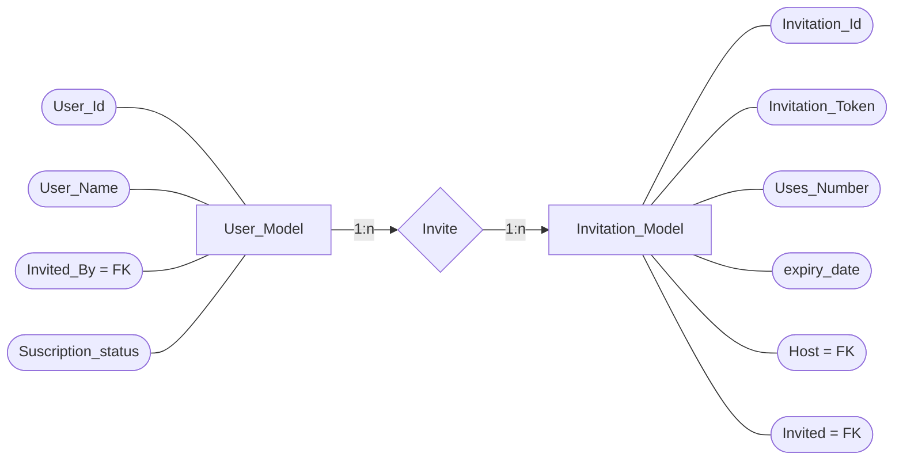

# Documento de Requerimientos de Software.


## 1. Propósito.

- ​    Permitirles a los usuarios ya inscritos y verificados en HackRocks emitir códigos de invitación temporales y de un solo uso para que personas no registradas lo puedan hacer, percibiendo posteriormente un beneficio mutuo que incentive la acción.

- ​    Generar un registro permanente de relaciones entre invitados y anfitriones. 

- ​    Beneficiar al usuario anfitrión de la cantidad de usuarios invitados que se suscriban al plan Pro. 

  ---

## 2. Alcance.

- ​    El objetivo general de la funcionalidad es el de  aumentar el numero de usuarios suscritos al plan PRO en HackRocks. 

- ​    Entre los objetivos específicos están:

  - Incentivar a los usuarios activos en HackRocks a invitar a personas no inscritas en la plataforma.

  - Ofrecer un beneficio a los usuarios ya inscritos y activos en HackRocks para incentivar a que inviten a nuevos usuarios y que estos últimos se vuelvan miembros PRO.

  - Ofrecer un beneficio a los usuarios invitados para incentivar que se suscriban al plan PRO.

  - Desarrollar mecanismos para evitar que los usuarios anfitriones inviten y registren cuentas falsas o a usuarios reales pero inactivos.

    

- ​    La funcionalidad es exclusiva para la aplicación de HackRocks.
- ​    Para el desarrollo de la funcionalidad se verán afectadas las estructuras del modelo de usuario, challenge, ...

---

## 3. Historias de Usuario.

| Historia de Usuario Nro: 1   | Invitar usuarios para que se unan a Pro                      |
| ---------------------------- | ------------------------------------------------------------ |
| **Como:**                    | Usuario anfitrión.                                           |
| **Quiero:**                  | invitar a personas para que se unan a HackRocks y que se suscriban al plan Pro |
| **Para:**                    | poder obtener un beneficio cada mes.                         |
| **Criterios de Validación:** | Se logra registrar un nuevo usuario en HackRocks utilizando un código de invitación que genera una relación entre los dos usuarios implicados y brindando un beneficio que incentive al nuevo usuario invitado a pagar el plan Pro y otro beneficio para el usuario anfitrión que le incentive a lograr una cierta meta de invitaciones para obtener la recompensa. |

---


| Historia de Usuario Nro: 2   | Crear claves de invitación.                                  |
| ---------------------------- | ------------------------------------------------------------ |
| **Como:**                    | Usuario anfitrión.                                           |
| **Quiero:**                  | crear claves de invitación para usar en campañas de publicidad |
| **Para:**                    | poder monitorizar la cantidad de usuarios que se suscriben con esta clave y cuantos se vuelven Pro y cuantos no. |
| **Criterios de Validación:** | Se logra crear una clave de invitación para registrar a un numero determinado de usuarios o hacerlo durante un tiempo determinado, para poder llevar un registro del rendimiento de las invitaciones. |

---


| Historia de Usuario Nro: 3   |      |
| ---------------------------- | ---- |
| **Como:**                    |      |
| **Quiero:**                  |      |
| **Para:**                    |      |
| **Criterios de Validación:** |      |

---


## 4. Requerimientos Funcionales.

| __Requerimiento_01__ |Generación de códigos de invitación.|
| :--------------- | :----------------------------------------------------------- |
| __Descripción:__ | Generar códigos de invitación únicos y de opcional carácter temporal, que relacione a un usuario anfitrión con uno o múltiples usuarios invitados. |
| __Fundamentos:__ | Para diseñar un programa de referidos es necesario llevar registro de los usuarios que han sido invitados a la plataforma y de los usuarios que los invitaron. |
| __Criterio:__ | - La aplicación debe generarle al usuario un código único, de opcional carácter temporal y  con un numero de usos determinado.<br />    - Todo usuario que se registre a HackRocks con un código de invitación debe ser definido como usuario invitado y relacionado de forma permanente con el usuario anfitrión al que pertenezca el código. <br />     - La aplicación debe poder generar un numero máximo de códigos, en donde cada uno de ellos seas independientes entre si.<br />    - La caducidad de las claves debe poderse definir en base al numero de registros que pueda realizar o al tiempo que transcurra desde que fue creada. |
| __Conflictos:__ | Ninguno. |
| __Prioridad:__ | Alta. |

---


| __Requerimiento_02__ |Limite de invitaciones.|
| :--------------- | :----------------------------------------------------------- |
| __Descripción:__ | Definir un numero máximo de invitaciones abiertas. |
| __Fundamentos:__ | El numero de códigos de invitación sin cerrar debe ser limitado para evitar que usuarios malintencionados puedan generar claves de forma ilimitada. Sin embargo no existiría un numero máximo de usuarios invitados relacionados con el anfitrión, mas sí un numero limitado de invitaciones. |
| __Criterio:__   | - La aplicación permitirá al usuario generar un numero limitado de claves de invitación.<br />      - Al utilizarse una de sus claves de registro se le permitirá al usurario generar otra nueva clave.<br />      - Un usuario puede poseer tantas claves como quiera siempre y cuando estas claves estén relacionadas al menos con un usuario. |
| __Conflictos:__ | Ninguno. |
| __prioridad:__ | Media. |


---


| Requerimiento_03 |Beneficios por la invitación.|
| :--------------- | :----------------------------------------------------------- |
| __Descripción:__ | Definir y otorgar beneficios a los usuarios implicados en la operación. |
| __Fundamentos:__ | Como forma de incentivo para que los usuarios opten por esta forma de registro y no por el registro típico, es necesario ofrecer un beneficio que compense la búsqueda de posible nuevos usuarios dispuestos a suscribirse por parte de los usuarios ya existentes (usuario anfitrión) y un beneficio que compense la suscripción al plan pro por parte de los usuarios no inscritos (usuario invitado). <br />    Además los beneficios dispuestos para los usuarios existentes solo deben de ser otorgados luego de que el usuario registrado con su código de invitación se suscriba al plan pro de HackRocks, de esta forma se desincentiva a los usuarios a generar invitaciones indiscriminadamente o que creen usuarios falsos para añadirlos a su red de invitados. |
| __Criterio:__   | - Cada usuario implicado en la operación debe recibir un beneficio en función de su rol. <br />      - El anfitrión solo debe percibir beneficios luego de que el usuario invitado por él se vuelva Pro .<br />      - El invitado debe recibir un beneficio que le inste a suscribirse al plan Pro.<br />      - __Las condiciones dadas para la obtención de los beneficios por parte del usuario anfitrión tendrán un carácter mensual, por lo que para volver a recibir el beneficio el usuario tendrá que volver a cumplir enteramente las condiciones definidas.__<br />      - __Las condiciones dada para la obtención de los beneficios por parte del usuario anfitrión tendrán un carácter continuo el cual seria evaluado mensualmente, por lo que para volver a recibir el beneficio el usuario tendrá que mantener cumplimentadas las condiciones.  __ |
| __Conflictos:__ | Ninguno. |
| __Prioridad:__ | Media. |

---


| Requerimiento_04 | Sobrescritura de las invitaciones.                           |
| :--------------- | :----------------------------------------------------------- |
| __Descripción:__ | Los códigos de invitación caducados o cerrados que no hayan sido usados deben de poder ser eliminados o sobrescritos en el modelos de invitación. |
| __Fundamentos:__ | Para evitar la acumulación de claves caducadas, la aplicación puede eliminar aquellas que hayan caducado o sobrescribir el campo relacionado con el usuario en el modelo, cuya clave ya haya expirado y sustituir la clave por una nueva y un nuevo criterio de expiración. |
| __Criterio:__    | - Si un usuario tiene relacionado a su cuenta una o mas claves de registro caducadas o desactivadas que además no posean registros relacionados, la aplicación debe poder eliminarlas del modelo o sino poder sobrescribirlas definiéndole una nueva clave de registro y  un nuevo criterio de expiración. |
| __Conflictos:__  | Ninguno.                                                     |
| __Prioridad:__   | Baja.                                                        |

---


| Requerimiento_05 | Monitorización de las invitaciones.                          |
| :--------------- | :----------------------------------------------------------- |
| __Descripción:__ | Permitirle al usuario monitorizar y controlar el estado de sus invitaciones. |
| __Fundamentos:__ | Para que el usuario logre conocer el estado de sus invitaciones, de las condiciones definidas, de su red de invitados y poder modificar o cancelar las invitaciones emitidas, es necesario que este disponga de una vista que le permita ejecutar todas estas funciones. |
| __Criterio:__    | - El usuario deberé poder conocer cuantas invitaciones ha emitido, el estado de cada una de ellas y cuantos usuarios se han inscrito utilizándola<br />      - El usuario deberé poder cancelar la posibilidad de registro con un código invitación.<br />      - El usuario deberá poder conocer el estado y avance de las condiciones para la obtención de los beneficios.<br />      - El usuario deberá poder monitorizar su lista de invitados, y saber cuales están suscritos al plan Pro, beneficiándolo, y cuales aun no están suscritos a Pro. |
| __Conflictos:__  | Ninguno.                                                     |
| __Prioridad:__   | Media.                                                       |


```sequence
User -> App: Petición del código de invitación.
App--> User: Creación código \n y relación unica con usuario.
User -> New_User: Entrega del código de invitación.
New_User -> App: Registro como invitado.
App --> User: Creación de relación invitado-anfitrión.
App --> New_User: Creación de relación invitado-anfitrión.
Note over User, New_User: La relación entre usuarios es de 1:n. \n Un anfitrión puede tener muchos invitados, pero los \n invitados  un solo anfitrión.
New_User -> App: Pago suscripción Pro.
App --> User: Verificar cumplimiento de condiciones. \n Aplicar o actualizar estado de beneficios 
```




## 5. Características de los Usuarios.

​    La funcionalidad va dirigida esencialmente a dos tipos de usuario, los usuarios ya inscritos y aquellas personas no registradas que tras ser invitadas puedan pasar a ser miembros Pro. 

---

## 6. Lista de Casos de Uso del Producto.

| CU01.Caso_de_Uso.    | Petición de clave de registro.                               |
| -------------------- | ------------------------------------------------------------ |
| **Descripción :**    | El sistema debe proveer una clave de invitación al usuario y que con esta clave otros usuarios se puedan registrar como invitados por él. |
| __Precondiciones:__ | El usuario anfitrión debe estar registrado en HackRocks.     |
| __Actor Principal:__ | Usuario.                                                     |

Flujo de eventos básico:

| Administrador / Usuario                                      | El sistema:                                                  |
| ------------------------------------------------------------ | ------------------------------------------------------------ |
| 1. El usuario registrado en HackRocks  decide pedir una clave de invitación para hacerla llegar a otros posibles usuarios. | 2. El sistema verifica que no ha alcanzado el numero máximo de claves activas, si no ha alcanzado el limita, el sistema le devuelve una nueva clave de invitación relacionada a su cuenta, y si ya ha llegado al limite de claves no utilizadas o inactivas, le retorna un error. |

---


| CU02.Caso_de_Uso.    | Registro con clave de invitación.                            |
| -------------------- | ------------------------------------------------------------ |
| **Descripción :**    | Cada usuario registrado con una clave de invitación a HackRocks debe de generar una relación unica y permanente con el usuario anfitrión que le entregó la clave. |
| __Precondiciones:__ | No estar previamente registrado en HackRocks y hacerlo utilizando una clave de invitación. |
| __Actor Principal:__ | Usuario no registrado.                                       |

Flujo de eventos básico:

| Administrador / Usuario                                      | El sistema:                                                  |
| ------------------------------------------------------------ | ------------------------------------------------------------ |
| 1. El usuario no registrado consigue una clave de invitación a HackRocks y se registra en la plataforma haciendo uso de ella. | 2. El sistema verifica si el usuario que esta en proceso de registro lo hace utilizando una clave de invitación, si es así verifica que la clave pertenezca a un usuario activo y prosigue con el registro como usuario invitado, generando una relación permanente con el usuario anfitrión. En el caso de que la clave no exista se devuelve un error. |
| 3. El usuario invitado, ahora registrado en HackRocks como usuario invitado, intenta pagar el plan Pro haciendo uso del beneficio  definido para incentivar su suscripción. | 4. El sistema verifica si el usuario fue invitado y dispone del beneficio por registrarse de este modo, si este es el caso el usuario se registra pro y se le comunica a su usuario anfitrión que un miembro de su red de contactos ahora es un usuario Pro de HackRocks. |

---


| CU03.Caso_de_Uso.    | Monitorización y manejo de las claves de invitación.         |
| -------------------- | ------------------------------------------------------------ |
| **Descripción :**    | El usuario anfitrión debe poder manejar y monitorizar todas las contraseñas emitidas. |
| __Precondiciones:__ | Ser miembro y anfitrión en HarckRocks.                       |
| __Actor Principal:__ | Usuario anfitrión.                                           |

Flujo de eventos básico:

| Administrador / Usuario                                      | El sistema:                                                  |
| ------------------------------------------------------------ | ------------------------------------------------------------ |
| 1. El usuario accede a la vista de invitaciones dentro de la plataforma de HackRocks. | 2. El sistema le retorna una vista en donde se muestra el numero de invitaciones abiertas, los usuarios por él, el status de la suscripción de cada uno de ellos y el progreso respecto al objetivo definido para alcanzar el beneficio. |
| 3. El usuario intenta eliminar una clave de invitación.      | 4. El sistema verifica que la clave de invitación no esté relacionada a ningún usuario, y si es así elimina esa contraseña relacionada con el usuario. Si la contraseña ya está relacionada a un usuario el sistema retorna un error. |

---


| CU04.1.Caso_de_Uso.  | Otorgar un beneficio continuo a los usuarios anfitriones que cumplan las condiciones. |
| -------------------- | ------------------------------------------------------------ |
| **Descripción :**    | A cada usuario anfitrión que logre cumplir con un numero determinado de invitaciones y suscripciones Pro, se le debe de otorgar un beneficio especifico que sirva como incentivo siempre y cuando su numero de referidos suscritos a Pro permanezca siendo igual o mayor al objetivo. |
| __Precondiciones:__ | Ser usuario anfitrión.                                       |
| __Actor Principal:__ | Usuario anfitrión e invitado.                               |

Flujo de eventos básico:

| Administrador / Usuario                         | El sistema:                                                  |
| ----------------------------------------------- | ------------------------------------------------------------ |
| 1. Un usuario invitado paga la suscripción pro. | 2. El sistema verifica si este usuario tiene una relación de invitado con otro usuario y si este es el caso se le cuenta un usuario Pro afiliado a su numero de usuarios invitados y se verifica si ha alcanzado el objetivo mensual definido para recibir la recompensa. <br />      Si el usuario no tiene relación de invitado con nadie, se registra de manera regular, y si fue invitado pero su anfitrión aun no alcanza el objetivo, se le suma un punto en el contador del anfitrión y se continua con el registro regular. |
> ​     Para esta modalidad de recompensas se puede diseñar un contador que se reinicie mensualmente o cada vez que caduque la suscripción pro del usuario anfitrión, comenzando de nuevo cada vez que este renueve. De esta manera se pueden contar cuantos usuarios se han suscrito a Pro dentro del margen de tiempo que comprende su suscripción y aplicar el beneficio únicamente si en ese periodo de tiempo se cumplen las condiciones. 

---


| CU04.2.Caso_de_Uso.  | Otorgar un beneficio mensual a los usuarios anfitriones que logren cumplir la condición cada mes. |
| -------------------- | ------------------------------------------------------------ |
| **Descripción :**    | A cada usuario anfitrión que logre cumplir con un numero determinado de invitaciones y suscripciones Pro mensuales, se le debe de otorgar un beneficio especifico que sirva como incentivo siempre y cuando este cumpla con el objetivo mensual de invitados unidos al plan Pro. |
| __Precondiciones:__ | Ser usuario anfitrión.                                       |
| __Actor Principal:__ | Invitar a usuarios no registrados en HackRocks y que estos paguen la suscripción Pro. |

Flujo de eventos básico:

| Administrador / Usuario                               | El sistema:                                                  |
| ----------------------------------------------------- | ------------------------------------------------------------ |
| 1. Un nuevo usuario invitado paga la suscripción pro. | 2. El sistema verifica si este nuevo usuario tiene una relación de invitado con otro usuario y si este es el caso se le cuenta un usuario Pro afiliado a su numero de usuarios invitados y se verifica si ha alcanzado el objetivo definido para recibir la recompensa mensual. <br />      Si el usuario no tiene relación de invitado con nadie, se registra de manera regular, y si fue invitado pero su anfitrión aun no alcanza el objetivo, se le suma un punto en el contador del anfitrión y se continua con el registro regular. |
> ​     Esta modalidad de recompensa solo considera a los nuevos usuarios que se registren con una invitación, por lo que los objetivos se reinician mensualmente y dependen de la cantidad de nuevas personas que se añadan a la plataforma.  
>
> Tambien es posible eliminar la variable del tiempo y llevar un contador que desbloquee beneficios en función del numero de personas que se inscriban y paguen al menos un mes de suscripción Pro en HackRocks.

---


| CU06.Caso_de_Uso.    |      |
| -------------------- | ---- |
| **Descripción :**    |      |
| __Pre-condiciones:__ |      |
| __Actor Principal:__ |      |

Flujo de eventos basico:

| Administrador / Usuario | El sistema: |
| ----------------------- | ----------- |
|                         |             |
---


- 

900102801