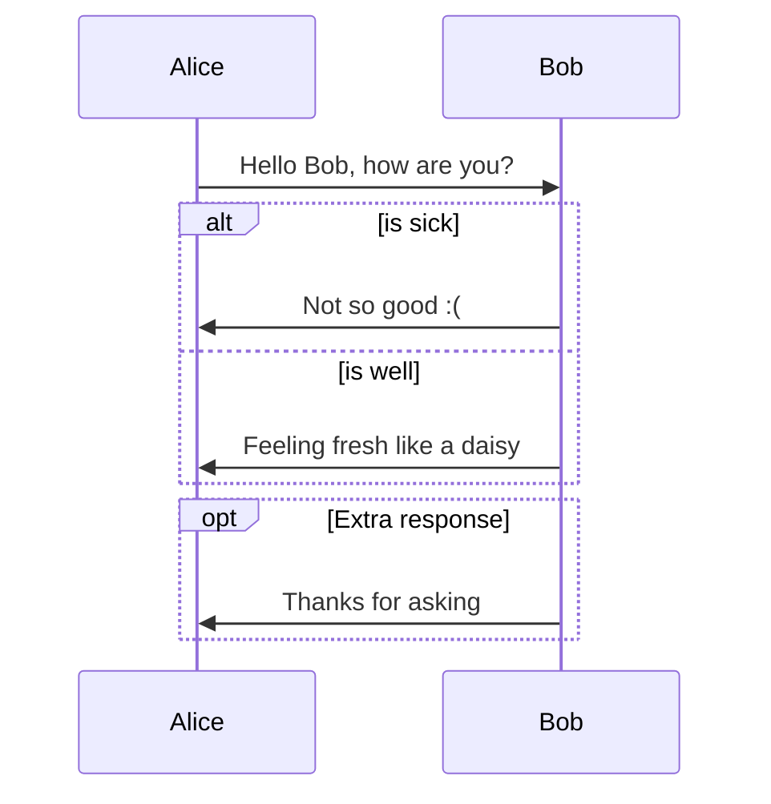

# <a id = "Header">MarkDown</a>

---


## HEADERS :

​		To create different levels of structure through titles and subtitles, simply put a "#" at the beginning of the text.  Multiple `##` in a row denote smaller heading sizes.

​		You can use one sharp `#` all the way up to `######` six for different heading sizes.

```markdown
  # First title.
  ## Second title.
  ### third title 
```
---


## TEXT :

### *ITALIC TEXT*

​	Enclose  the text between  `*`  or `_` to make it *italic* 

```markdown
  *This text will be italic*
  _This will also be italic_

```

*This text will be italic*
_This will also be italic_


### BOLD TEXT

​	Enclose the text between two asterisks to make it **bold**

```markdown
  **This text will be bold**
  __This will also be bold__
```

**This text will be bold**
__This will also be bold__


### STRIKETHROUGH

​	Any word wrapped with two tildes (like `~~this~~`) will appear crossed out.

```
  ~~this text will be crossed out~~ 
```
~~this text will be crossed out~~


---


## LINKS

​	Links are hyper links, on click it, move to other section /url of web resources.

​	There are many types of links can be created in Markdown.


### URL LINKS

​	Inline links contains text which displayed to user enclosed in square brackets `[]` and link URL enclosed in parens `()` Links Url is absolute URL like domain name.

```markdown
  [Text displayed](https://www.w3schools.io/file/markdown-introduction/)
```

  [Text displayed](https://www.w3schools.io/file/markdown-introduction/)

```html
  <a href="https://www.w3schools.io/file/markdown-introduction/">Text displayed</a>
```
<a href="https://www.w3schools.io/file/markdown-introduction/">Text displayed</a>


### INTERNAL LINKS

​	Internal Link starts with <a> tag with unique id defined by the attribute 'id' which can be linked.

```markdown
[Text displayed](#Header)
```

[Text displayed](#Header)


### MAILTO LINKS

​	To add email address links, the Link must contains mailto with colon and email address

```markdown
  [Mailto Link](mailto:contact.mail@example.com)
```

[Mailto Link](mailto:contact.mail@example.com)

---


## LIST :  

### NUMBERED LIST
​	Just write a 1. at the beginning of the item.

​	And if you have sub points, put two spaces or one tab before the number.

```markdown
  1. first point

     1. sub point
     1. sub point

  1. secong point
```

1. first point

   1. sub point
   1. sub point

1. secong point

   
  ```markdown
  1. first point

    1.1. sub point
    1.2. sub point

  2. secong point
  ```

1. first point

   1.1. sub point
   1.2. sub point

2. secong point

   


### UNNUMBERED LIST
​	Just write a  *  or  -  at the beginning of the item.
​	
​	And if you have sub points, put two spaces or one tab before the dash or star.

```markdown
  * first point
    * sub-first point
    * sub-first point

  * second point
```
* first point
	* sub-first point
	* sub-first point
	
* second point

  

```markdown
    - first point
      - sub-first point
      - sub-first point 

    - second point
```
- first point
  - sub-first point
  - sub-first point 
- second point


### TASK LIST

​	To write a list of tasks, just write a pair of  `[ ]`  after the  `-` of the item, empty if the task is not complete ot with an "x" inside if the task is complete.

```markdown
- [x] This is a complete item
- [ ] This is an incomplete item
```

- [x] This is a complete item
- [ ] This is an incomplete item

---


## CODE

​	There are many ways to get a code style. 

​	For a **inline code blocks**, wrap them in backticks   `   .

```python
	num_list = [i for i in range(10)]
```
`num_list = [i for i in range(10)]`

​	For write **multiples lines of code**, without indentation, wrap them in three backticks ```.

​	If you'd like to use syntax highlighting, include the language in te first line, after de bacticks.

```python
num_list = []

for i in range(10):
    num_list.append(i)
```

​	Or you can indent with for spaces.

```python
num_list = []

for i in range(10):
	num_list.append(i)
```

---


## QUOTES

​		To quote a person, a `>` is placed at the beginning of the text.Coffee. The finest organic suspension ever devised... I beat the Borg with it.
```markdown
  > First quote in markdown.
  > 		Author.

```
> First quote in markdown.
> 		Author.


```
<blockquote>
    <p>First quote in HTML.</p>
</blockquote>
```


<blockquote>
    <p>First quote in HTML.</p>
</blockquote>


---


## IMAGES

```markdown
  
```
​	  


---


## TABLE

​	You can create tables by assembling a list of words and dividing them with hyphens `-` (for the first row), and then separating each column with a pipe `|`:

​	**Align cell data using colon symbol:**

​	Header and cell data can be aligned to left or right of a columns in a table Below example explains about alignment

- Content to align left by prefix colon `:` before dashes - `:---`
- Right align by suffix colon `:` after dashes - `---:`
- Centre align by prefix and suffix colon `:` for dashes - `:---:`


​	**Some of the rules of markdown tables**

- Header are separated by pipes
- **tables with out header are not supported in core specification**
- Minimum of 3 dashes under each header name is required, can declare more than three dashes
- Pipes symbol is optional, but use for readability
- Each column of row data is separated by pipe symbol
- There can be multiple rows pipe symbol on row start and end are optional.
- table’s data like header and row can contain simple text or markdown content


```markdown
  **Header 1** |**Header 2**  | **Header 3**
   :---: | :--- | ---:
  data 1.1|data 2.1|data 3.1
  data 1.2|data 2.2|data 3.2
```

**Header 1** |**Header 2**  | **Header 3**
   :---: | :--- | ---: 
  data 1.1|data 2.1|data 3.1
  data 1.2|data 2.2|data 3.2


```html
<table>
   <thead>
      <tr>
         <th>Header 1</th>
         <th>Header 2</th>
         <th>Header 3</th>
      </tr>
   </thead>
   <tbody>
      <tr>
         <td>data 1.1</td>
         <td>data 2.1</td>
         <td>data 3.1</td>
      </tr>
      <tr>
         <td>data 1.2</td>
         <td>data 2.2</td>
         <td>data1 3.2</td>
      </tr>
   </tbody>
</table>
```

<table>
   <thead>
      <tr>
         <th>Header 1</th>
         <th>Header 2</th>
         <th>Header 3</th>
      </tr>
   </thead>
   <tbody>
      <tr>
         <td>data 1.1</td>
         <td>data 2.1</td>
         <td>data 3.1</td>
      </tr>
      <tr>
         <td>data 1.2</td>
         <td>data 2.2</td>
         <td>data1 3.2</td>
      </tr>
   </tbody>
</table>


---


## MATHEMATICS

[LaTeX Math Symbols](https://www.math.uci.edu/~xiangwen/pdf/LaTeX-Math-Symbols.pdf)

$\gamma$

 $$ \overline{x} = \frac{1}{n} \sum  \limits_{i = 1} ^{n} x_i = \frac{x_1 + x_2 + ... + x_n}{n}$$ 


---

## EMOJIS

​	[Emoji's list](https://www.webfx.com/tools/emoji-cheat-sheet/)

```markdown
:+1:, :fire:, :metal:, :rooster:, :zap:
```

:+1:, :fire:, :metal:, :rooster:, :zap:


---


## DIAGRAMS
[typora.io](https://support.typora.io/Draw-Diagrams-With-Markdown/)

### SEQUENCE DIAGRAMS

This feature uses [js-sequence](https://bramp.github.io/js-sequence-diagrams/), which turns the following code block into a rendered diagram:

~~~gfm
```sequence
Alice->Bob: Hello Bob, how are you?
Note right of Bob: Bob thinks
Bob-->Alice: I am good thanks!
```
~~~

```sequence
Alice->Bob: Hello Bob, how are you?
Note right of Bob: Bob thinks
Bob-->Alice: I am good thanks!
```

### Flowcharts

This feature uses [flowchart.js](http://flowchart.js.org/), which turns the following code block into a rendered diagram:

~~~gfm
```flow
st=>start: Start
op=>operation: Your Operation
cond=>condition: Yes or No?
e=>end

st->op->cond
cond(yes)->e
cond(no)->op
```
~~~

```flow
st=>start: Start
op=>operation: Your Operation
cond=>condition: Yes or No?
e=>end

st->op->cond
cond(yes)->e
cond(no)->op
```

### Mermaid

Typora also has integration with [mermaid](https://mermaid-js.github.io/mermaid/#/), which supports sequence diagrams, flowcharts, Gantt charts, class and state diagrams, and pie charts.

#### Sequence Diagrams

For more details see [these instructions](https://mermaid-js.github.io/mermaid/#/sequenceDiagram).

~~~gfm

~~~


